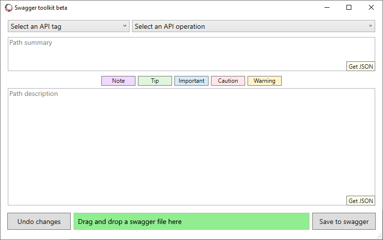

# Swagger toolkit beta

An open source toolkit for editing JSON swagger files.

## Product features

- Supports editing the API path summary and description fields by using Markdown.
- Converts multi-line Markdown to single-line Markdown, which is required for insertion into a JSON Swagger file.
- Applies a consistent JSON document format.
- Uses the Microsoft [System.Text.Json](https://docs.microsoft.com/dotnet/standard/serialization/system-text-json-overview) library.
- Provides a way to extract the summary and description in JSON format without saving to a Swagger file.
- Supports quick insert of Markdown or [Docs Markdown](https://marketplace.visualstudio.com/items?itemName=docsmsft.docs-markdown) constructs like notes and tips.

## Future features

- Configurable character escaping.
- Support for editing more Swagger fields.
- Autorest validation.

## Getting started

1. To get started, drop a JSON Swagger file onto the path textbox. You can test the app by using this [sample](./resources/samples/sample-swagger.json) Swagger file.

   

2. In the **Select an API tag** list, select an API tag. The list contains all [tags](https://swagger.io/docs/specification/grouping-operations-with-tags/) from the Swagger file.

3. In the **Select an API operation** list, select an operation. The list contains all [operationIds](https://swagger.io/docs/specification/paths-and-operations/) from the Swagger file that are relevant to the selected [tag](https://swagger.io/docs/specification/grouping-operations-with-tags/).

4. Edit the summary, the description, or both fields. For the description, you can use the snippet buttons such as **Table** to add a construct at the current cursor position.

   

5. Optionally, select one of the **Get JSON** buttons to convert summary or description content to JSON and save it in your system clipboard. This option doesn't save changes to the Swagger file.

6. Select **Undo changes** or **Save to swagger** to discard or save your edits for the current API page. If you navigate to a new API page without first selecting **Save to swagger**, the app discards any edits.

Verify your changes in a diff viewer.

## Manually compile a single file executable

You can use Visual Studio to compile and install the app.

### Prerequisites

- [.NET 5+](https://dotnet.microsoft.com/download)
- [Visual Studio 2019+](https://visualstudio.microsoft.com/vs/)

### Create an executable

1. Open the project in Visual Studio.

1. From the menu bar, select **Build** > **Publish...**.

1. Select the option for publishing to a folder, and then select **Finish**.

1. Select **Show all settings**.

1. Select **Framework-dependent** and **Produce single file** in the profile settings, and note the **Target location** of the compiled executable.

1. Select **Publish**.
